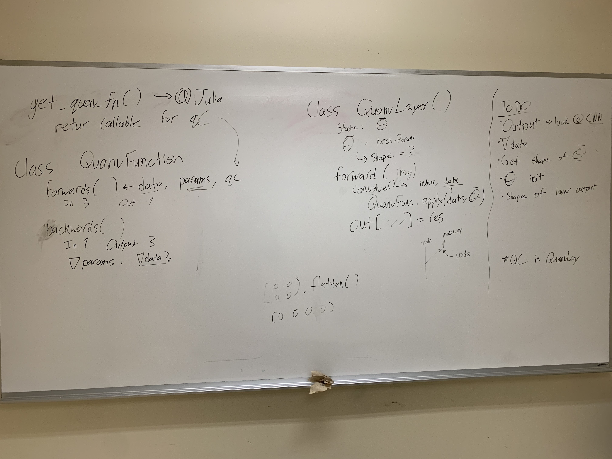

# March 16
Location: BMH 116

### Agenda:
- Go over integration plan and code layout
  
### Notes
- The main components that will build up our final model are given below:

- Everyone should be tagged with `@YourName` where their code belongs. Feel free to make any changes as you see fit but give me a heads up
- @Julia we need a reference to the circuit so it might make more sense to build a `QuanvCircuit` class that has a `run` method. We should talk about what this should look like but a take a crack at it and let's chat Sunday
- @Tristan add your gradient code to the `backwards` method of `QuanvFunction`. Please check which gradients we need to evaluate - it might be safest to both the gradient w.r.t `input_data` and `params` but check [this example](https://pytorch.org/docs/stable/notes/extending.html#example)
- @Julia and @Tristan please talk about measuring the quantum circuit
- @Robbie you are responsible for the `convolve` and `forward` methods of the `QuanvLayer` class - I added some structure to the code so let me know if you have any questions about it
- @Connor first test out the resizing transform I sent you for the data loader. Then I want you looking into the output shape of the model. Why is `out_channels` something that we provide to the model? How does it affect our code? How are the outputs of CNNs defined? Take some time to look more into CNNs in this regard.

### Action Items
- Everyone should create their own branch and start adding you code to the structure in `model.ipynb`. This is subject to some change (especially for julia and tristan) but get it in there anyway.
- See above for tasks.

